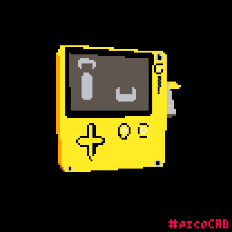
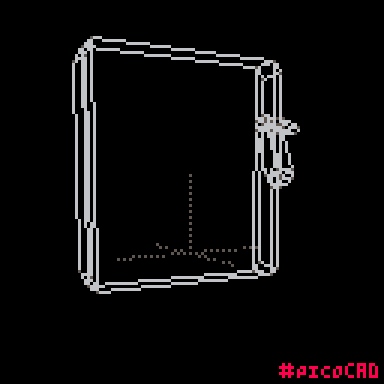

# Playdate Retro Mascot — Retrocon 2026

Welcome to the official showcase site for the **Playdate Retro Mascot**, an interactive service built specifically for **Retrocon 2026** in Brazil!

Live Demo: [playdate-picad.vercel.app](https://playdate-picad.vercel.app/)

---

## About Retrocon 2026

**Retrocon 2026** is the premier celebration of retro gaming and classic hardware in Brazil, taking place in São Paulo on August 15-16, 2026. Bringing together thousands of retro gamers, collectors, developers, and hardware modders, Retrocon celebrates the legacy of pixel art, classic chips, and the innovative indie platforms that keep the retro spirit alive today.

---

## The Mascot: Retro Playdate

To celebrate this event, we've developed an interactive virtual mascot based on the **Playdate**—the charming yellow handheld game system. 

This interactive mascot is built using a custom low-poly 3D model (picoCAD format) rendered in real-time. As you scroll through the page, the console reacts dynamically, showing off various retro expressions and hardware features:

* **Dynamic Facial Expressions**: The console screen acts as a retro LCD face that responds to interactions and speed of rotation with classic animations:
  * **Happy**: The mascot welcomes you with cute blinking chevrons.
  * **Surprised**: Spinning spiral eyes when the console rotates quickly.
  * **Oh No / Exploding**: A worried face as the console begins to slide apart.
  * **Dead**: Placed on the internals during disassembly state.
  * **Relieved**: Relaxed eyes once it settles back together.
* **Exploded Schematic View**: The mascot disassembles scroll-reactively in real-time, showing its internal circuitry, chips, gold contacts, and custom 14-day battery pack in a retro blueprint style.
* **Interactive Winding Crank**: Spin the crank on the side of the device reactively as you scroll or watch the retro screen showcase.
* **Embedded Video Display**: When fully zoomed in during the final section, the console screen blends into an embedded video display.

### Mascot Previews

Here is the PicoCad model:




---

## 3D Model Credits & PicoCAD Aesthetics

The low-poly 3D model of the Playdate used in this project is based on the fantastic work by creator **DefinitelyDog**. You can check out their original project on itch.io: [Playdate picoCAD by DefinitelyDog](https://definitelydog.itch.io/playdate-picocad).

### Why PicoCAD?
We chose **picoCAD** as the modeling tool for this mascot because of its inherent retro charm:
* **Nostalgic Constraints**: picoCAD forces a retro, low-poly wireframe aesthetic reminiscent of early 90s console graphics (like the Sega Saturn or Nintendo 64).
* **Flat Shaded Look**: Its texture atlas limitations and orthographic style match the Playdate's own minimalist and quirky philosophy.
* **Authenticity**: Using a real retro-focused CAD tool creates a perfect thematic alignment for a project built for a convention like **Retrocon 2026**.

---

## Technical Features

This application is built with modern, performant web standards:
* **React + Vite** for fast HMR and optimized compilation.
* **Three.js / @react-three/fiber** for hardware-accelerated 3D graphics.
* **Custom Fragment Shaders** to map the screen bounds, dynamic canvas textures, and retro flat-shaded light calculations.
* **Portable Relative Asset Paths** configured for zero-setup deployment under any subdirectory.

---

## How to Run & Build

To run the project locally or build it for deployment on a server:

### 1. Install Dependencies
```bash
npm install
```

### 2. Run the Development Server
```bash
npm run dev
```

### 3. Build for Production
To bundle the project with fully relative, host-agnostic paths (outputs to `dist/` directory):
```bash
npm run build
```
